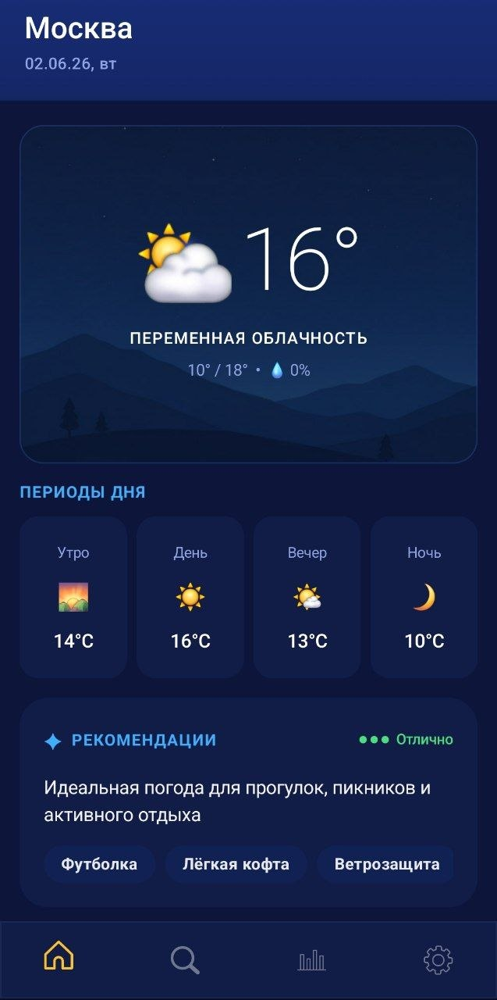
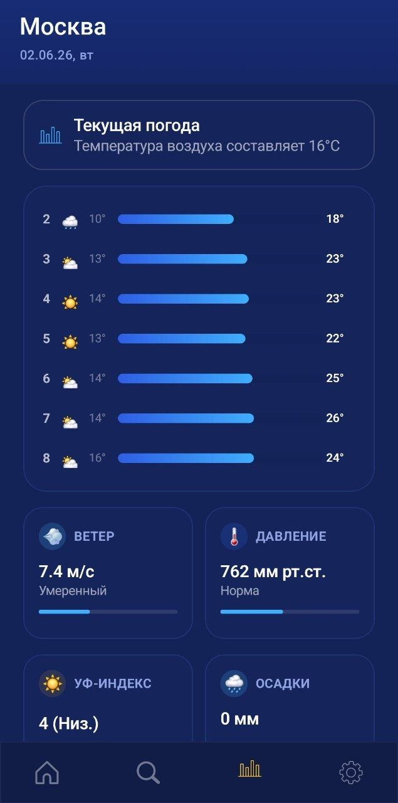
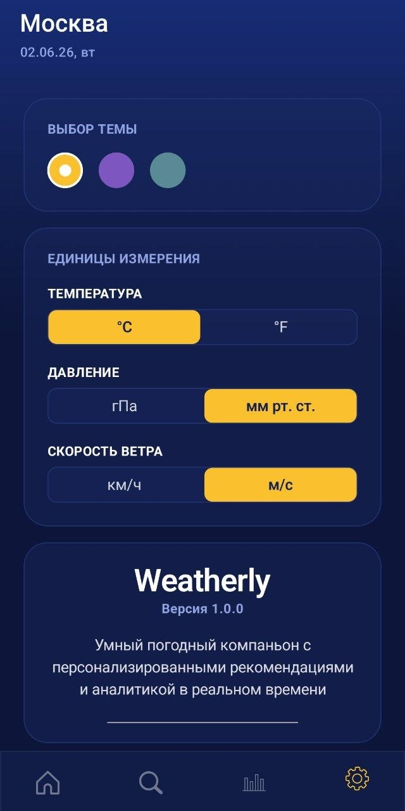

[](https://github.com/Ganesha1967/weatherly-app/releases/download/debug-latest/weatherly-debug.apk)

# Weatherly 🌤️

A smart Android weather application featuring personalized recommendations, detailed analytics and real-time weather forecasts

---

## Application Screenshots

   

---

## Features

* **Accurate Weather Forecasts** - up-to-date weather information for any city
* **Personalized Recommendations** - clothing suggestions and daily planning tips based on current weather conditions
* **Weather Analytics** - detailed insights into weather metrics and atmospheric conditions
* **City Search** - quickly search for locations and save them to favorites
* **Multiple Themes** - customize the app's appearance to match your preferences
* **Flexible Unit Settings**:

    * Temperature: °C / °F
    * Pressure: hPa / mmHg
    * Wind Speed: m/s / km/h

---

## 🛠️ Tech Stack

* **Kotlin** - primary programming language
* **Jetpack Compose** - modern declarative UI toolkit
* **Material Design 3** - latest Android design system
* **Hilt** - dependency injection
* **Room** - local data storage and caching
* **Ktor** - networking and API communication
* **Kotlin Coroutines & Flow** - asynchronous and reactive programming
* **Spotless** - automated source code formatting
* **Detekt** - static code analysis for Kotlin
* **Ktlint Gradle** - Kotlin code formatting and linting during builds

---

## 📥 Installation & Setup

### Clone the Repository

```bash
git clone https://github.com/Ganesha1967/weatherly-app.git
```

### Run the Project

1. Open the project in **Android Studio**
2. Wait for Gradle synchronization to complete
3. Build the project
4. Run the application on an emulator or a physical Android device

### Build APK

```bash
./gradlew assembleDebug
```

---

## System Requirements

| Parameter                   | Value                |
| --------------------------- | -------------------- |
| Minimum Android Version     | Android 10 (API 29)  |
| Recommended Android Version | Android 14+ (API 34) |
| Free Storage Space          | ~40 MB               |

---

## Download

[Download latest APK](https://github.com/Ganesha1967/weatherly-app/releases/download/debug-latest/weatherly-debug.apk)

---

## Contributing

Contributions are welcome and appreciated!

If you'd like to contribute:

1. Fork the repository
2. Create a feature branch:

   ```bash
   git checkout -b feature/your-feature-name
   ```
3. Make your changes and ensure the project builds successfully
4. Run code quality checks and formatting tools
5. Commit your changes with a clear commit message
6. Push your branch and open a Pull Request

Please follow the project's coding conventions and keep pull requests focused on a single improvement or feature whenever possible

Bug reports, feature requests and suggestions are also welcome through GitHub Issues


---

## 📄 License

This project is licensed under the **MIT License**. See the `LICENSE` file for more details

